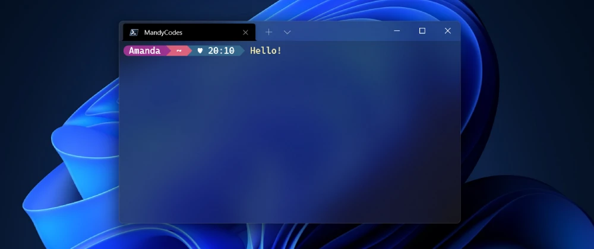

# Como personalizar o seu Windows Terminal com Powershell e oh-my-posh

> Tags: #braziliandevs #beginners #tutorial #productivity

Quem não cansou da carinha padrão e sem graça do terminal do computador não é mesmo? Aqui você vai aprender a deixar o seu com uma aparência muito mais agradável, divertida e pessoal!

---

## Requisitos para a nossa missão ⚒️

- [Windows Terminal](https://www.microsoft.com/en-us/p/windows-terminal/9n0dx20hk701?activetab=pivot:overviewtab)
- [Powershell](https://docs.microsoft.com/en-us/powershell/scripting/install/installing-powershell-on-windows?view=powershell-7.2)
- [oh-my-posh](https://ohmyposh.dev/)
- [posh-git](http://dahlbyk.github.io/posh-git/)

> _Tanto o **oh-my-posh** quanto o **posh-git** iremos instalar através de um script mais para frente..._

---

## Personalizando o perfil do Powershell 🎨

No Windows Terminal, você tem um perfil/aparência para cada shell, por exemplo, o Powershell ou o clássico cmd do Windows.

Para customizar os perfis basta pressionar `Ctrl + ,` ou abrir as configurações do Windows Terminal, conforme a imagem abaixo:


Em seguida, você poderá personalizar as fontes, tamanho do texto, entre outras configurações. Eu deixo tudo padrão, alterando apenas as seguintes opções:

**Na aba de configurações gerais:**

> **Nome:** o título que irá aparecer na aba do seu Windows Terminal para o Powershell, ou de outro shell que você estiver personalizando, você pode colocar um nome referente ao uso daquele shell, deixar o nome dele mesmo ou utilizar o seu nome, o que achar mais adequado para o seu uso;

> **Linha de comando:** o caminho para o shell que estiver atrelado ao perfil, neste caso, vamos adicionar o comando `-nologo` ao final do caminho, ficando por exemplo `C:\Program Files\PowerShell\7\pwsh.exe -nologo`, assim evitamos que o Powershell escreva detalhes da sua inicialização, deixando a tela mais limpa ao iniciar;

> **Diretório de inicialização:** a pasta onde o shell irá iniciar, você pode escolher, por exemplo, a pasta de um projeto especifico ou deixar como padrão a sua pasta de usuário, com a variável `%USERPROFILE%`, eu deixo com a minha pasta de usuário;

> **Ícone:** é o ícone que irá aparecer ao lado do nome na aba do Windows Terminal, você pode deixar o padrão, ou colocar algum ícone personalizado ao seu gosto.

**Na aba de aparência:**

> **Cor do tema:** é a paleta de cores utilizada para aquele perfil, eu utilizo a Campbell;

> **Fonte:** é a fonte utilizada, eu utilizo a Cascadia Code, mas você pode utilizar qualquer uma de seu gosto;

> **Tamanho da fonte:** você pode utilizar a que melhor se adequar as suas preferências e tamanho de tela, eu particularmente utilizo 12;

> **Cursor:** é o ponteiro que irá ser exibido ao digitar, eu particularmente utilizo a barra;

> **Acrílico:** é o efeito de transparência do fundo da janela, eu utilizo em 50%, mas é apenas uma preferência estética, e caso te atrapalhe, você pode optar por manter desativado.

Existem muitas outras personalizações que você pode alterar conforme a sua preferência, mas para não me estender muito, listei apenas as alterações necessárias e aquelas que eu particularmente altero.

---

## Finalizando com as instalações ☕

Para começar as instalações, precisamos abrir o Windows Terminal em modo de administração, e liberar a execução e instalação de módulos pelo Powershell, para isso, basta copiar e colar o comando abaixo clicando com o botão direito do mouse no seu terminal:

```powershell
Set-ExecutionPolicy -ExecutionPolicy RemoteSigned
```

Feito isso, vamos rodar o seguinte comando para abrir no VSCode (ou na sua IDE de preferência) um script para executar comandos em fila no nosso perfil:

```powershell
code $PROFILE
```

Agora basta colar o script abaixo, e ao salvar ele irá automaticamente executar os comandos no seu Powershell.

```powershell
Import-Module posh-git
Import-Module oh-my-posh
Set-PoshPrompt M365Princess
Enable-PoshTooltips

Clear-Host
```

> **Import-Module:** é o comando utilizado para baixar e instalar os módulos;

> **Set-PoshPrompt:** é o comando utilizado para definir o tema do seu oh-my-posh, no meu caso, eu utilizo o M365Princess, mas você pode encontrar outros [neste link](https://ohmyposh.dev/docs/themes);

> **Enable-PoshTooltips:** é o comando utilizado para ativar as [Tooltips](https://ohmyposh.dev/docs/config-tooltips) do oh-my-posh, que são dicas que aparecem no canto direito, como por exemplo, em qual branch você está trabalhando;

> **Clear-Host:** é o comando utilizado para sempre limpar a tela ao inicializar.

---

## Ao infinito e além! 🚀

Para finalizar podemos fechar tudo e voltar a inicializar o Windows Terminal fora do modo de administração sem problemas.

Não se preocupe se ficar quadradinhos no lugar de alguns elementos do tema, demora um pouco até as configurações se ajeitarem.

Aproveite também para testar outros temas e configurações para deixar o seu terminal ainda mais pessoal.

E nos vemos em breve! 💙

---

## Referências 📚

- [Documentação do oh-my-posh](https://ohmyposh.dev/)

- [Tutorial feito por Scott Hanselman](https://www.hanselman.com/blog/my-ultimate-powershell-prompt-with-oh-my-posh-and-the-windows-terminal)

- [Tutorial feito pela Microsoft](https://docs.microsoft.com/pt-br/windows/terminal/tutorials/custom-prompt-setup)

- [Tutorial feito por balta.io](https://balta.io/blog/windows-terminal)
