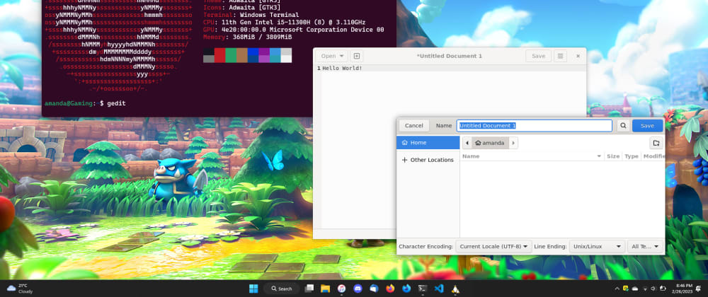
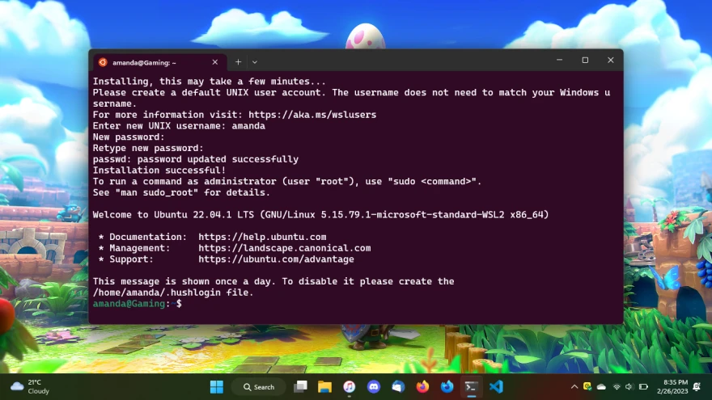
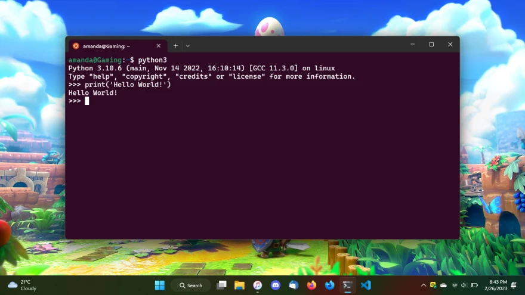
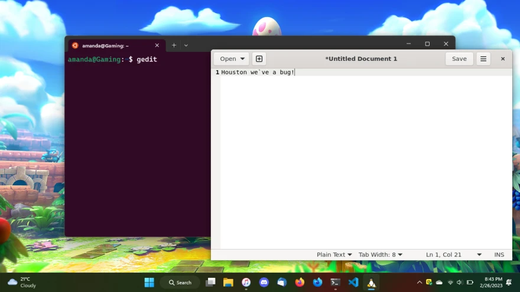
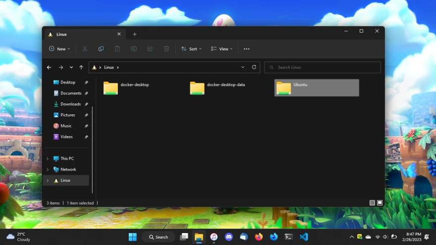
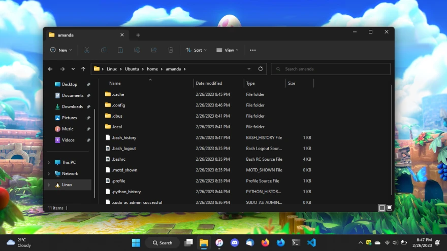

> Tags: #braziliandevs #beginners #tutorial #productivity

## O que seria, e para que serve o WSL? 🤔

O [WSL (Windows Subsystem for Linux)](https://pt.wikipedia.org/wiki/Subsistema_Windows_para_Linux) é uma ferramenta muito poderosa do [Windows](https://pt.wikipedia.org/wiki/Microsoft_Windows), disponível para Windows 10 e 11, com o intuito de permitir a pessoas desenvolvedoras ou entusiastas, rodarem ambientes de [distros](https://pt.wikipedia.org/wiki/Distribui%C3%A7%C3%A3o_Linux) do [sistema operacional](https://pt.wikipedia.org/wiki/Sistema_operativo) [Linux](https://pt.wikipedia.org/wiki/Linux), sem a necessidade da configuração de uma [máquina virtual](https://pt.wikipedia.org/wiki/M%C3%A1quina_virtual) ou a instalação do mesmo junto ao Windows no HD/SSD, o famoso [dual-boot](https://pt.wikipedia.org/wiki/Inicializa%C3%A7%C3%A3o_m%C3%BAltipla).

Como veremos neste artigo, é algo relativamente simples e rápido, e pode ajudar de diversas formas, como por exemplo:

- Utilizar aplicações exclusivas do Linux
- Desenvolver ou colaborar em projetos Linux
- Estudar e se familiarizar com o sistema Linux

Tudo isso diretamente do Windows! 😊

---

## O que você irá aprender lendo este artigo? 🎉

- Como instalar o WSL
- Como configurar o Ubuntu (distro padrão)
- Como rodar aplicações gráficas do Linux
- Como acessar arquivos do ambiente Linux de cada distro
- Bônus: Como instalar outras distros

---

## Como instalar o WSL ⚒️

Para começarmos é muito simples, basta abrir o terminal do Windows e rodar o seguinte comando:

```shell
wsl --install
```

Logo irá começar a instalação, e para finalizar, será solicitar que você reinicie o computador, assim ele irá finalizar as configurações por meio de uma atualização do Windows.

---

## Como configurar o Ubuntu (distro padrão) 🐧

Para começarmos a utilizar o [Ubuntu](https://pt.wikipedia.org/wiki/Ubuntu), basta procurar no menu iniciar do Windows, o atalho "Install RELEASE Ubuntu" ou apenas "Ubuntu", ele irá iniciar a configuração também no terminal, e pedir para que você escolha um nome de usuário e uma senha.

> ⚠️ O nome de usuário e senha configurado, se trata das suas credenciais no ambiente Linux, portanto, não são as suas credenciais do Windows.

Feito isso, você já está com tudo preparado para começar a utilizar o Ubuntu, basta acessar o atalho para ele no seu menu iniciar e logar com as suas credenciais como solicitado.



Como exemplo, podemos utilizar o interpretador do Python, que por padrão, já vem pré-instalado no Ubuntu. Para isso, basta digitar python3 no terminal, e você já estará dentro dele.



Para finalizar o interpretador, basta pressionar CTRL + D.

Caso queira encerrar o Ubuntu, para que ele pare de rodar em segundo plano, gastando recursos da sua máquina, basta utilizar o seguinte comando:

```shell
wsl --terminate Ubuntu
```

---

## Como rodar aplicações gráficas do Linux 💻

Para rodar aplicações gráficas do Linux, você precisará instalar os drivers específicos de cada fabricante, de acordo com a sua placa de vídeo:

1. [Intel Driver de GPU para WSL](https://www.intel.com/content/www/us/en/download/19344/intel-graphics-windows-dch-drivers.html)
2. [AMD Driver de GPU para WSL](https://www.amd.com/en/support/kb/release-notes/rn-rad-win-wsl-support)
3. [NVIDIA Driver de GPU para WSL](https://developer.nvidia.com/cuda/wsl)

> ⚠️ Note que, caso a sua placa de vídeo seja Intel, o driver padrão, caso esteja atualizado, já vem com as suas funcionalidades do WSL, não sendo necessário instalar algo adicionalmente.

Feito isso, basta rodar o seguinte comando para atualizar as informações dos pacotes de aplicações do Linux:

```shell
sudo apt update
```

E para instalar a aplicação desejada, basta rodar o comando abaixo. Nesse caso, vamos utilizar o GEdit como exemplo, um editor de texto do Linux:

```shell
sudo apt install gedit
```

Para iniciá-lo, basta digitar o seu nome no terminal e pressionar ENTER:

```shell
gedit
```



---

## Como acessar arquivos do ambiente Linux de cada distro 📂

Para acessar os arquivos do seu ambiente Linux, basta abrir o Explorador de Arquivos do Windows, e clicar no menu Linux, no canto inferior esquerdo.

Feito isso, ele irá apresentar o atalho para os arquivos do ambiente do Ubuntu, ou se for o caso, dos vários ambientes instalados na sua máquina.



Basta clicar no Ubuntu, ou ambiente utilizado e navegar por suas pastas.

Como padrão, o diretório de arquivos de usuário, como por exemplo, os seus Documentos do Windows, no Linux, ficariam no seguinte caminho:

```
/home/seunome/Documentos/
```



Você pode copiar e colar arquivos do Windows para o Ubuntu, ou outros ambientes, e vice-versa.

---

## Bônus: Como instalar outras distros

Para ver a lista de distros disponíveis para utilização no WSL, basta utilizar o seguinte comando:

```shell
wsl --list --online
```

Para instalar uma determinada distro:

```shell
wsl --install -d nomedadistro
```

Para desinstalar e apagar totalmente um ambiente:

```shell
wsl --unregister nomedadistro
```

---

## Feedback ❤️

Gostou do artigo, viu algo de errado ou algo que poderia ser melhorado? Não deixe de comentar construtivamente por aqui ou nas redes sociais! Isso ajuda muito a melhorar o meu conteúdo e consequentemente contribuir melhor para a nossa comunidade de tecnologia.

Se possível, compartilha nas redes sociais, com suas amizades ou conexões profissionais para que o conteúdo alcance quem precise dele.


---

## Referências 📚

- [WSL (Windows Subsystem for Linux)](https://pt.wikipedia.org/wiki/Subsistema_Windows_para_Linux)
- [Windows](https://pt.wikipedia.org/wiki/Microsoft_Windows)
- [Distribuições Linux](https://pt.wikipedia.org/wiki/Distribui%C3%A7%C3%A3o_Linux)
- [Sistema Operacional](https://pt.wikipedia.org/wiki/Sistema_operativo)
- [Linux](https://pt.wikipedia.org/wiki/Linux)
- [Máquina Virtual](https://pt.wikipedia.org/wiki/M%C3%A1quina_virtual)
- [Dual-Boot](https://pt.wikipedia.org/wiki/Inicializa%C3%A7%C3%A3o_m%C3%BAltipla)
- [Ubuntu](https://pt.wikipedia.org/wiki/Ubuntu)
- [Instalar o WSL | Microsoft Learn](https://learn.microsoft.com/pt-br/windows/wsl/install)
- [Executar aplicativos de GUI do Linux com o WSL | Microsoft Learn](https://learn.microsoft.com/pt-br/windows/wsl/tutorials/gui-apps)
